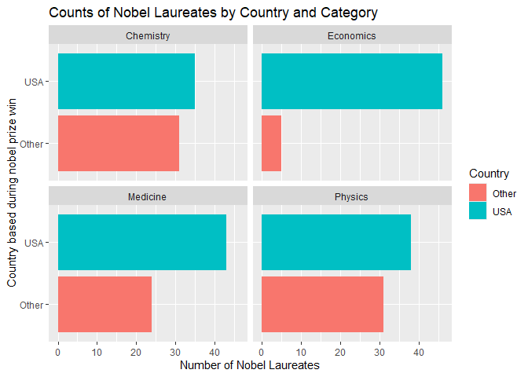
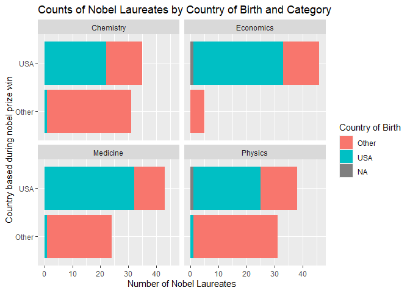

Lab 03 - Nobel laureates
================
Tsion
02/03/2026

### Load packages and data

``` r
library(tidyverse) 
```

``` r
nobel <- read_csv("data/nobel.csv")
```

## Exercises

Here is a link to the [lab
instructions](https://datascience4psych.github.io/DataScience4Psych/lab03.html).

### Exercise 1

``` r
glimpse(nobel)
```

    ## Rows: 1,026
    ## Columns: 26
    ## $ id                    <dbl> 1, 2, 3, 4, 5, 6, 6, 8, 9, 10, 11, 12, 13, 14, 1…
    ## $ firstname             <chr> "Wilhelm Conrad", "Hendrik A.", "Pieter", "Henri…
    ## $ surname               <chr> "Röntgen", "Lorentz", "Zeeman", "Becquerel", "Cu…
    ## $ year                  <dbl> 1901, 1902, 1902, 1903, 1903, 1903, 1911, 1904, …
    ## $ category              <chr> "Physics", "Physics", "Physics", "Physics", "Phy…
    ## $ affiliation           <chr> "Munich University", "Leiden University", "Amste…
    ## $ city                  <chr> "Munich", "Leiden", "Amsterdam", "Paris", "Paris…
    ## $ country               <chr> "Germany", "Netherlands", "Netherlands", "France…
    ## $ born_date             <date> 1845-03-27, 1853-07-18, 1865-05-25, 1852-12-15,…
    ## $ died_date             <date> 1923-02-10, 1928-02-04, 1943-10-09, 1908-08-25,…
    ## $ gender                <chr> "male", "male", "male", "male", "male", "female"…
    ## $ born_city             <chr> "Remscheid", "Arnhem", "Zonnemaire", "Paris", "P…
    ## $ born_country          <chr> "Germany", "Netherlands", "Netherlands", "France…
    ## $ born_country_code     <chr> "DE", "NL", "NL", "FR", "FR", "PL", "PL", "GB", …
    ## $ died_city             <chr> "Munich", NA, "Amsterdam", NA, "Paris", "Sallanc…
    ## $ died_country          <chr> "Germany", "Netherlands", "Netherlands", "France…
    ## $ died_country_code     <chr> "DE", "NL", "NL", "FR", "FR", "FR", "FR", "GB", …
    ## $ overall_motivation    <chr> NA, NA, NA, NA, NA, NA, NA, NA, NA, NA, NA, NA, …
    ## $ share                 <dbl> 1, 2, 2, 2, 4, 4, 1, 1, 1, 1, 1, 1, 2, 2, 1, 1, …
    ## $ motivation            <chr> "'in recognition of the extraordinary services h…
    ## $ born_country_original <chr> "Prussia (now Germany)", "the Netherlands", "the…
    ## $ born_city_original    <chr> "Lennep (now Remscheid)", "Arnhem", "Zonnemaire"…
    ## $ died_country_original <chr> "Germany", "the Netherlands", "the Netherlands",…
    ## $ died_city_original    <chr> "Munich", NA, "Amsterdam", NA, "Paris", "Sallanc…
    ## $ city_original         <chr> "Munich", "Leiden", "Amsterdam", "Paris", "Paris…
    ## $ country_original      <chr> "Germany", "the Netherlands", "the Netherlands",…

1.  The data has 1026 observations (rows) and 26 columns (variables).
    Each row represents a single Noble Laureate (specifying 26 different
    variables like firstname, lastname, year Noble won,
    date/city/country born,…)

### Exercise 2

``` r
nobel_living <- nobel %>%     #create nobel_living from nobel then pipe
  filter(                     
    is.na(died_date),        #died_date is NA
    !is.na(country),         #country is available (not NA)
    gender != "org"          #gender not equal to organization 
  ) 
```

``` r
nrow(nobel_living)
```

    ## [1] 253

I have confirmed there are 253 observations.

### Exercise 3

``` r
nobel_living <- nobel_living %>%           #pipeline to mutate the nobel_living data 
  mutate(                                   #create new variable               
    country_us = if_else(country == "USA", "USA", "Other")  
  )                                         #If country == "USA": label it as "USA"
                                            #Otherwise: label "Other"
```

``` r
table(nobel_living$country_us)           #make a frequency count table to check new variable
```

    ## 
    ## Other   USA 
    ##    91   162

``` r
nobel_living_science <- nobel_living %>%                
  filter(category %in% c("Physics", "Medicine", "Chemistry", "Economics")) 
#%>% is pipe   
#%in% checks if a certain value is found in the group specified (y/n) 
#c creates a vector (list of values)
```

``` r
ggplot(data = nobel_living_science, aes(x=country_us, fill = country_us)) +
  geom_bar() +
  facet_wrap(~category) +
  coord_flip() +                      #could also just put y=country_us?
  labs(
    x = "Country based during nobel prize win",
    y = "Number of Nobel Laureates",
    title = "Counts of Nobel Laureates by Country and Category",
    fill = "Country"
  )
```

<!-- -->

Based on our bar graphes, it certainly looks like the data supports the
Buzzfeed article’s headline. In each category, we can see that the
number of nobel laureates living in the US when they won their prizes is
greater than those that are outside of the US.

### Exercise 4

``` r
nobel_living <- nobel_living %>%
  mutate(
    born_country_us = if_else(born_country == "USA", "USA", "Other")
  )
```

``` r
table(nobel_living$born_country_us) 
```

    ## 
    ## Other   USA 
    ##   138   113

There are 113 US born nobel laureates.

### Exercise 5

``` r
nobel_living_science <- nobel_living %>%                
  filter(category %in% c("Physics", "Medicine", "Chemistry", "Economics")) 
```

``` r
ggplot(data = nobel_living_science, aes(x=country_us, fill = born_country_us)) +
  geom_bar() +
  facet_wrap(~category) +
  coord_flip() +                     
  labs(
    x = "Country based during nobel prize win",
    y = "Number of Nobel Laureates",
    title = "Counts of Nobel Laureates by Country of Birth and Category",
    fill = "Country of Birth"
  )
```

<!-- -->

Ok, now it has become a little ambiguous. Earlier, we saw that the
majority of people who won science-related nobel prizes were based in
the United States. But now we are seeing that, out of the these winners
living in the US, a significant portion of them are born in the US, and
there also seems to be a very small portion in the Physics category that
is potentially unknown/missing information. So, from this visualization,
I can’t say that our data supports Buzzfeed’s claim. …

### Exercise 6

…
